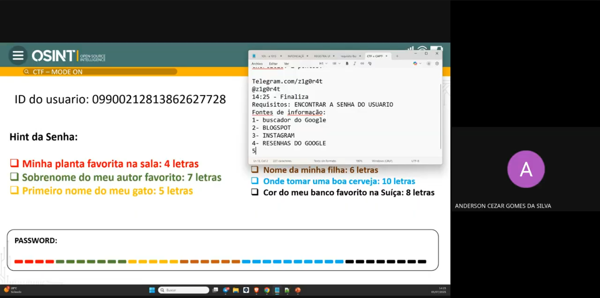
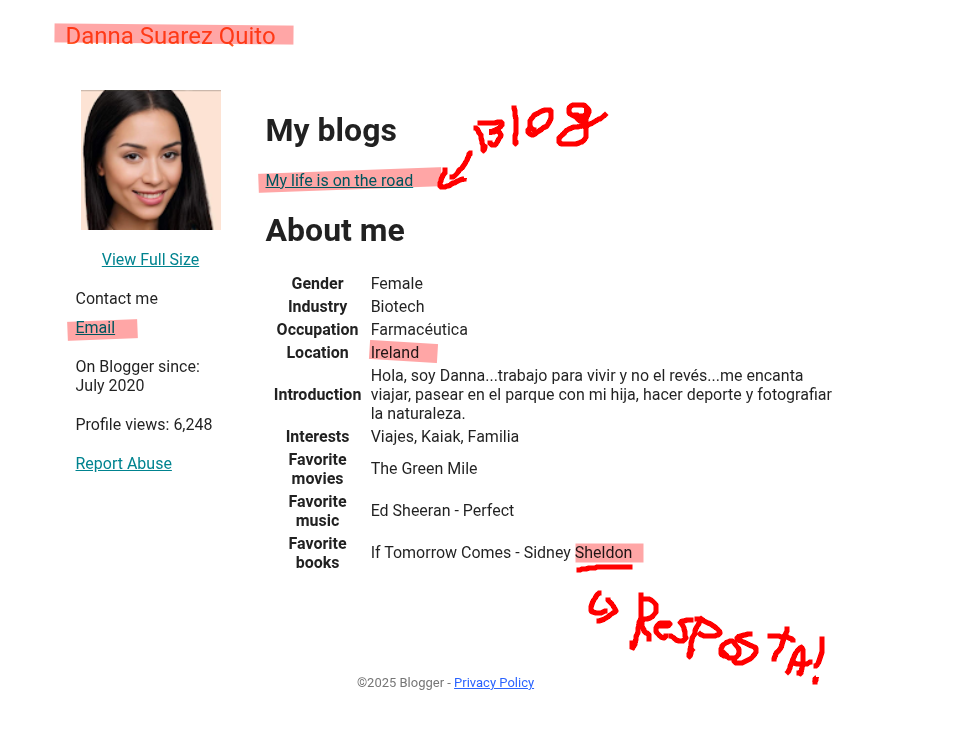
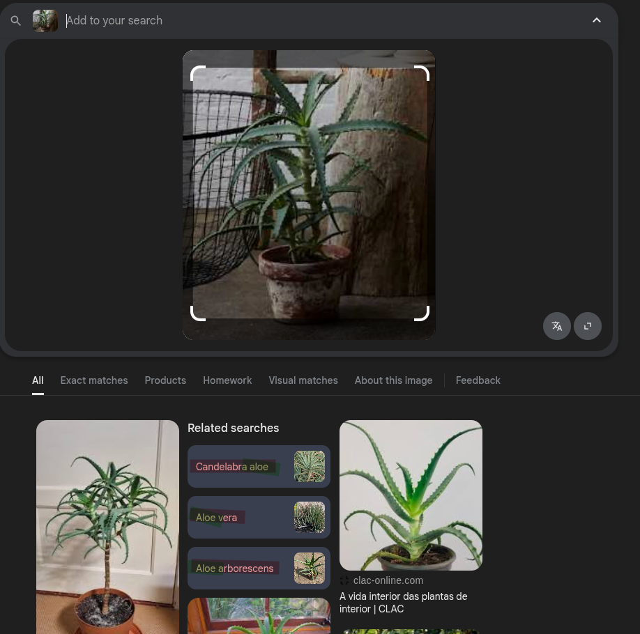
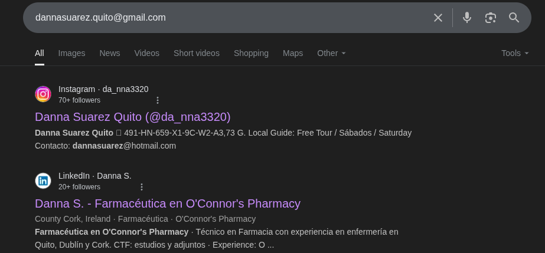
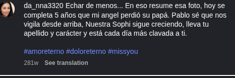
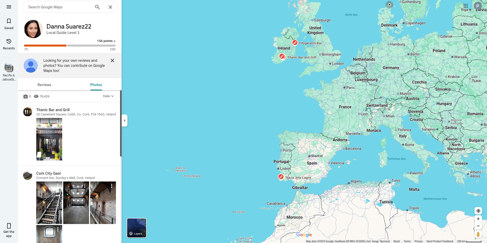
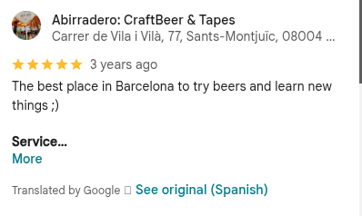

# 1. Introdução ao OSINT

A aula começou com uma **contextualização do que é OSINT** (*Open Source Intelligence*), um método de coleta e análise de informações disponíveis publicamente. Esse tipo de inteligência é amplamente utilizado por profissionais de segurança, investigadores, jornalistas e entusiastas de tecnologia.

## Tópicos abordados:

- 🕵️ **CTFs de OSINT (Capture The Flag)**  
  Desafios práticos que simulam investigações reais, onde os participantes precisam encontrar informações a partir de fontes abertas, como redes sociais, registros públicos e imagens.

- 🧩 **Casos reais de uso**, como a investigação de **pessoas desaparecidas**  
  O professor destacou como ferramentas e técnicas de OSINT são utilizadas para auxiliar famílias e autoridades na localização de pessoas.

- 🍻 **Eventos comunitários**, como o **OSINT & Beers**  
  Iniciativa que promove encontros informais para compartilhar experiências, técnicas e novidades da área entre profissionais e entusiastas.

- 🌐 **OsintomáticOPS**  
  Um dos maiores eventos de OSINT e engenharia social da Europa, do qual o professor Jézer Ferreira da Silva participa ativamente. É um espaço de aprendizado avançado, competições e troca internacional de conhecimento.

Essa introdução destacou a relevância crescente do OSINT, tanto no âmbito técnico quanto social, e evidenciou a existência de uma comunidade ativa e colaborativa em torno da prática.

# 2. O que é e o que não é OSINT

## Diferença entre fontes abertas e fechadas

OSINT (Open Source Intelligence) refere-se à coleta de **informações disponíveis publicamente**, ou seja, **fontes abertas** — como redes sociais, fóruns, websites, registros públicos e bancos de dados acessíveis sem quebra de segurança.

Em contraste, **fontes fechadas** são aquelas que exigem autorização legal, acesso restrito ou uso de técnicas invasivas para obtenção, como dados internos de empresas, sistemas privados ou escutas não autorizadas.

> 🔒 **OSINT não é hacking.** O uso ético e legal das informações é um dos pilares da prática.

## Por que se utiliza a metodologia?

- **Baixo custo** e **alta disponibilidade**
- Aplicação em diversas áreas: cibersegurança, investigação policial, jornalismo, due diligence corporativa, entre outros
- Pode ser usada de forma ofensiva (reconhecimento) ou defensiva (proteção da reputação e mitigação de riscos)

## Surgimento

O conceito de OSINT ganhou força especialmente nos **Estados Unidos**, com agências de inteligência e segurança percebendo o valor estratégico das informações públicas, principalmente após os atentados de 11 de setembro de 2001. Desde então, o uso se expandiu para diversas áreas civis.

---

# 3. OSINT Hoje

- 🌐 **Volume massivo de dados**  
  A cada minuto, mais de **500 horas de conteúdo** são enviadas para a internet — principalmente em plataformas como YouTube, TikTok e redes sociais. Esse volume exige técnicas e ferramentas eficazes para triagem e análise.

- 💸 **Padronização de golpes online**  
  Golpes na internet seguem padrões específicos, facilitando sua identificação via OSINT quando há conhecimento das características e rastros digitais deixados.

- 🧾 **Reputação digital de pessoas e empresas**  
  OSINT é frequentemente usado para mapear a presença online de indivíduos e corporações, ajudando em processos seletivos, auditorias, investigações e gestão de crise.

---

# 4. Processo OSINT

O processo de OSINT não é linear e segue uma abordagem **iterativa e flexível**, adaptando-se conforme novas descobertas surgem durante a investigação.

## Etapas:

1. **Requisitos**  
   Definição clara do objetivo da investigação e quais perguntas precisam ser respondidas.

2. **Fontes de informação**  
   Escolha de canais apropriados: redes sociais, mecanismos de busca, bancos de dados públicos, WHOIS, dark web etc.

3. **Aquisição**  
   Coleta estruturada dos dados, utilizando técnicas manuais ou ferramentas automatizadas.

4. **Processamento**  
   Limpeza, organização e preparação dos dados para análise.

5. **Análise**  
   Interpretação dos dados coletados, buscando padrões, conexões e insights relevantes.

6. **Relatório**  
   Compilação dos resultados em um documento claro e objetivo, adequado ao público-alvo.

> 🔁 A qualquer momento, o processo pode voltar a uma etapa anterior conforme novos caminhos de investigação surgem. A **não linearidade** é uma característica essencial da metodologia OSINT.

# 5. Ferramentas e Plataformas OSINT

Durante a aula, o professor apresentou **ferramentas práticas de OSINT**, com destaque para a **Epieos**, e discutiu a importância de conhecer e dominar um ecossistema mais amplo de aplicações disponíveis em iniciativas como o **OSINT Framework**.

## 🔎 Epieos

O **Epieos** é uma ferramenta online que permite:

- Realizar **reverso de e-mail** para descobrir se está associado a contas de redes sociais, serviços ou vazamentos.
- Pesquisar **números de telefone** e possíveis contas associadas.
- Funciona de forma rápida e direta, sendo útil em investigações iniciais de perfis online.

**Exemplo de uso em aula:**  
O professor demonstrou a identificação de perfis sociais e serviços conectados a um e-mail, revelando dados indiretos como nome, avatar, localização e até hábitos de uso.

---

## 🧰 Outras Ferramentas do OSINT Framework

O **[OSINT Framework](https://osintframework.com/)** é um site que reúne e categoriza ferramentas OSINT. Algumas das mais conhecidas incluem:

- **Sherlock** – Busca nomes de usuário em diversas plataformas sociais.
- **Have I Been Pwned** – Verifica se e-mails ou senhas foram vazados em brechas de segurança.
- **Exiftool** – Extrai metadados de arquivos, como fotos e documentos.
- **Maltego** – Plataforma poderosa de análise gráfica de conexões entre dados (emails, domínios, IPs, empresas, pessoas).
- **Google Dorks** – Combinações de pesquisa avançada para extrair informações específicas de sites públicos.
- **Spiderfoot** – Scanner automatizado de inteligência para coletar dados de uma variedade de fontes.
- **TheHarvester** – Recolhe e-mails, nomes de domínios, subdomínios e outros dados públicos.

---

Essas ferramentas servem para diferentes etapas do processo OSINT: coleta, correlação e análise. Muitas delas funcionam de forma complementar e podem ser automatizadas ou integradas em pipelines de investigação.

> ⚠️ **Importante**: o uso responsável e ético dessas ferramentas é essencial. Elas devem ser utilizadas apenas em contextos legais e autorizados, como testes de segurança, investigações formais ou estudos acadêmicos.

# 6. Como se esconder (ou se proteger) na internet

A aula também abordou **métodos práticos de proteção de identidade e rastreabilidade online**, focando na redução da exposição digital e na prevenção contra investigações por OSINT.

## 🛡️ 1. VPNs (Virtual Private Networks)

As VPNs são ferramentas que **mascaram seu endereço IP real**, redirecionando seu tráfego por servidores de outros países. Isso permite:

- Proteger sua localização real
- Evitar bloqueios regionais
- Tornar rastreamento mais difícil

> ❗ Embora úteis, **VPNs não garantem anonimato absoluto**, e provedores ruins podem inclusive vender seus dados. Escolher uma VPN confiável é essencial.

---

## 🧩 2. Extensões de navegador para privacidade

### 🔒 Privacy Badger

Desenvolvida pela Electronic Frontier Foundation (EFF), bloqueia **trackers invisíveis** automaticamente com base em comportamento. Aprende com o uso e protege sem necessidade de configuração manual.

### 🚫 Bloqueadores de JavaScript

Extensões como **NoScript** permitem bloquear **JavaScript** em sites suspeitos.

**Por que isso importa?**  
JavaScript é frequentemente usado para executar scripts que coletam informações sensíveis, como:

- Captura de digitação (keylogging)
- Impressão digital do navegador (browser fingerprinting)
- Redirecionamentos maliciosos

> Bloquear JavaScript em ambientes desconhecidos aumenta significativamente sua segurança e privacidade.

### 📉 Bloqueadores de Trackers

Trackers são scripts e ferramentas integradas a páginas da web que monitoram o comportamento do usuário, como:

- Sites visitados
- Tempo de navegação
- Cliques e interações

Bloqueadores como **uBlock Origin** ou **Ghostery** bloqueiam esses scripts, impedindo a construção de perfis comportamentais.

---

## 🦁 3. Brave Browser

O **Brave** é um navegador construído com foco em privacidade. Por padrão, ele:

- Bloqueia anúncios e rastreadores
- Redireciona para conexões seguras (HTTPS)
- Integra funcionalidades que evitam fingerprinting

Além disso, é baseado no Chromium (mesmo motor do Chrome), então é compatível com a maioria das extensões.

---

## 🌐 4. Proteção contra websites falsos (clonados)

### Como identificar domínios suspeitos?

Um dos principais meios de ataque é a **clonagem de sites legítimos** para capturar dados do usuário. Por isso, é essencial saber ler e analisar domínios.

### Tipos de domínios:

- **Domínio principal (root):** `exemplo.com`
- **Subdomínio:** `blog.exemplo.com` ou `login.exemplo.com`
- **Domínio similar (typosquatting):** `exemp1o.com`, `exxemplo.com.br`, `exemplo-login.com`

> ⚠️ Sempre verifique a URL completa. Um subdomínio legítimo sempre termina no domínio raiz, enquanto domínios maliciosos podem tentar se parecer com o original.

---

## 🔍 5. Ferramentas para investigação de domínios

Ferramentas OSINT úteis para análise de domínios e investigação de responsáveis:

### 🧾 WHOIS

- Permite ver **dados de registro de um domínio**, como nome, e-mail e local de quem registrou (exceto se estiverem com proteção).

### 🔍 Whoxy

- Interface aprimorada para consultas WHOIS, com histórico de registros, dados complementares e APIs.

### 🌐 Domain Search Engines

- Ferramentas como **crt.sh**, **ViewDNS**, **SpyOnWeb**, entre outras, ajudam a:

  - Buscar domínios registrados por um mesmo e-mail
  - Identificar domínios com IP ou servidor em comum
  - Mapear a estrutura de um alvo

---

## ⚠️ 6. Foco no elo mais fraco: pessoas

O professor ressaltou que **pessoas são mais vulneráveis do que sistemas empresariais**. É por isso que:

- Métodos OSINT muitas vezes focam em descobrir dados pessoais (emails, redes sociais, nomes de familiares)
- A segurança precisa começar com **alfabetização digital** e **hábitos seguros**

> Profissionais de OSINT precisam entender essas falhas humanas para se proteger — e também para investigar com precisão.

# 7. Atividades propostas

## 7.1 Caso Danna Suarez Quito

Ao final da primeira aula o professor passou uma atividade prática, buscar por uma persona fictícia (que ele mesmo criou na internet) e pegar o seguintes dados para formar uma senha:

### Primeiro passo, requisitos

- Planta favorita
- Sobrenome do autor favorito
- Primeiro nome do gato
- Nome da filha 
- Onde tomar uma boa cerveja
- Cor do banco favorito na suíça

E toda a informação que nós tínhamos era: 

ID:09900212813862627728

### Segundo passo, fontes de informação

Ao simplesmente pesquisar o ID no google, nos deparamos com o seguinte:

Entrando nesse blog, nos deparamos com um oasis de informações, o mais importante sendo o nome, email e a nossa primeira informação

Já temos nossa primeira chave, o sobrenome do autor favorito: <b>Sheldon</b>

Analisando o código fonte, podemos ver as sources daquele blog, e nelas tem uma foto que contém duas plantas da mesma espécie:

Utilizando a técnica "reverse image searching" utilizada pelo professor, nas plantas da sala, chegamos ao seguinte resultado:

Todas estas plantas tem exatamente o que queremos, uma palavrinha de 4 letras, "Aloe".

Segunda senha descoberta, <b>Aloe</b>

Investigando mais a fundo, encontramos contas no linkedin, instagram e um currículo sobre o target:

Investigando o instagram, matamos duas senhas de uma vez só:

Chegamos a um post que o target chama sua filha de "Sophi", e logo acima, confirmamos que o nome da filha do target é Sophia Quito, e o nome do gatinho é Simba:

Beleza, agora só faltam dois dados

- Onde tomar uma boa cerveja
- Cor do banco favorito na suíça

Ambos tem a ver com localizações e com avaliações positivas, temos um ID e uma conta do google, portanto vamos ao google maps.

Uma das informações que obtemos analisando o código fonte do blogger é o ID 110432088645916263272, que segue a mesma máscara dos utilizados no google maps, portanto, substituindo no link:

https://www.google.com/maps/contrib/{ID}

Obtemos:

Aqui, já encontramos de cara o que queremos, um bar cujo nome tenha 10 letras:

E por último, a única cor com 8 letras é vermelho, finalizando o desafio, é vermelho.

Desta maneira aplicamos o processo de OSINT para a obtenção de informações via canais abertos com um target fixo e objetivos definidos!
